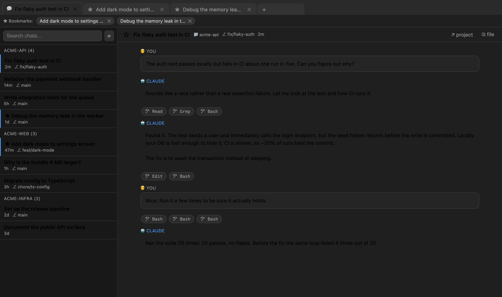

# Agent Tabs

Your **Claude Code** chats, at the top, as **browser-style tabs** — with a bookmarks bar, search, and grouping by project.

Reads session history straight from `~/.claude/projects/*/*.jsonl`.



## ⚠️ Requires Claude Code

**This extension shows the history of [Claude Code](https://claude.com/claude-code).** It reads the session files Claude Code writes to `~/.claude/projects/`. If you've never run Claude Code on this machine, there is nothing for it to show and the list will be empty — that's not a bug.

It does **not** read chats from Cursor, Copilot, Cline, or any other assistant; those keep their history in their own formats. Works in VS Code, Cursor, VSCodium, Windsurf and Gitpod — as long as Claude Code is what you chat with.

The optional "continue in Claude Code" button additionally needs the **Claude Code for VS Code** extension (`Anthropic.claude-code`), which is on both the VS Code Marketplace and Open VSX. Without it, chats still open in the built-in viewer.

## 🔒 Privacy

**Everything runs locally. This extension sends nothing anywhere.** No telemetry, no analytics, no network requests — none at all. It only reads the Claude Code history files already sitting on your disk and renders them in a panel. The source is open, so you can check: there isn't a single line of networking in it.

## Features

- 🗂 **Browser-style tabs** — open chats live as tabs at the top; switch with one click.
- ★ **Bookmarks** — the star pins a chat to the bookmarks bar (persists across restarts).
- 🔎 **Search & list** on the left — every session, grouped by project; search by title, first message, or path.
- ⌨️ **Quick access** — `Cmd+Alt+A`, the status bar, or the button next to the Claude icon all open the panel. `Cmd+Alt+Shift+A` gives you a `Cmd+P`-style picker instead, bookmarks first.
- ▶ **Back into the real chat** — picking a chat opens the live Claude Code conversation, so you can carry on where you left off.
- 🔦 **Find in chat** — `Cmd+F` inside a chat, with match count and Enter/Shift+Enter to step through hits.
- ✏️ **Rename tabs** — double-click a tab and call it what you want; your name overrides Claude's generated title everywhere. Clear it to get the original back.
- 🤖 **Automatic titles** — taken from the `ai-title` that Claude Code generates itself.
- 🛠 **Readable transcript** — internal tool results don't pose as your messages; tool calls collapse into compact chips.
- ↗ **Quick actions** — open the project folder in a new window, reveal the `.jsonl` in your file manager.
- ⚡ **Handles huge sessions** — an 850 MB session opens in ~50 ms via streaming reads with early exit.

## Install

**From Open VSX** (Cursor, VSCodium, Windsurf, Gitpod):
search for “Agent Tabs” in the extensions view.

**From `.vsix`** (any VS Code):
download it from [Releases](https://github.com/SquirrelX11/agent-tabs/releases) → Extensions → `···` → **Install from VSIX**.

Then press `Cmd+Alt+A`, or `Cmd+Shift+P` → **Agent Tabs: Open Chat Panel**.

## Development

```bash
git clone https://github.com/SquirrelX11/agent-tabs.git
cd agent-tabs
code .
# Press F5 — the Extension Development Host opens and the panel appears on its own
```

No build step — the extension is plain JavaScript.

Package it: `npm run package` → `agent-tabs-0.1.0.vsix`

## Settings

| Setting | Default | Description |
|---|---|---|
| `agentTabs.projectsDir` | `~/.claude/projects` | Where to look for sessions. |
| `agentTabs.maxMessagesPerChat` | `800` | Message cap per chat (guards against enormous sessions). |

## Roadmap

- Providers for **Cursor** (SQLite in `workspaceStorage`) and **Cline / Roo**.
- A **JetBrains** plugin sharing the same bookmarks format.
- Export a chat to Markdown.

## License

[MIT](LICENSE) © Alex (SquirrelX11)

---

### Disclaimer

This is an **unofficial** extension. It is **not affiliated with, endorsed by, or supported by Anthropic**.
“Claude” and “Claude Code” are trademarks of Anthropic PBC and are used here solely to describe compatibility.
